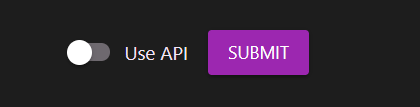

# První stránka

## Typy stránek

- Uložená jako soubor - tato varianta se hodí pro většinu uživatelů. Soubory ukládá přímo do souborového systému aplikace a není zapotřebí žádný speciální script na zobrazení této stránky

- API - data se uloží jako text do databáze a speciální script pak tyto data umožní číst a zobrazit na stránkách. Tato varianta se hodí pokud chcete umožnit ostatním doménám získávat data z vašich stránek

Typ stránek zvíme při přidávání stránky

## Přidání stránky

- Stránku můžeme přidat kliknutím na nová stránka v menu nebo na tlačítko plus v seznamu všech stránek

- Prvně nastavíme název stránky. Toto jméno se bude zobrazovat v prohlížeči a seznamu stránek
- Poté adresu na které bude stránka dostupná. Používejte pouze malá a velká písmena anglické abecedy (tedy bez háčků a čárek) a čísla, nepoužívejte žádné speciální znaky

> Pokud zadáte třeba 'produkty' tak vaše stránka bude dostupná na www.vasedomena.cz/produkty

-Kráktý popisek, ten se zobrazuje v administraci a zároveň je potřebná pro vyhledávače a některé jiné nástroje
- Jako poslední je zapotřebí zvolit šablonu

## Uprava stránky

- Upravit je možné jak nově vytvořenou tak i již existující stránku

- Obsah se upravuje přímo na stránce a je možné přepisovat texty a měnit obrázky a odkazy