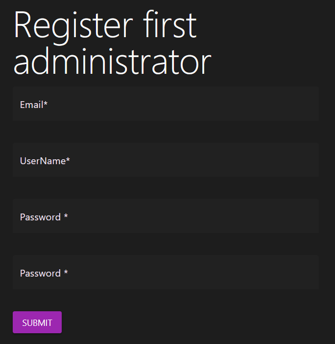

# Začínáme

## Registrace prvního administrátora

- Po instalaci je zapotřebí zaregistrovat prvního administrátora, administrátor má přístůp ke všem funkcím CMS, tato role by tedy měla být udělováná jen speciálně pověřeným osobám.

- Jako uživatelské jméno doporučujeme zvolit jméno skutečné neboť toto jméno se bude zobrazovat jako autor příspěvků pro všechny v aplikaci (toto jméno je možné změnit)
- Heslo musí být složeno alespoň z dvanácti znaků kombinujících malá a velká písmena a čísla